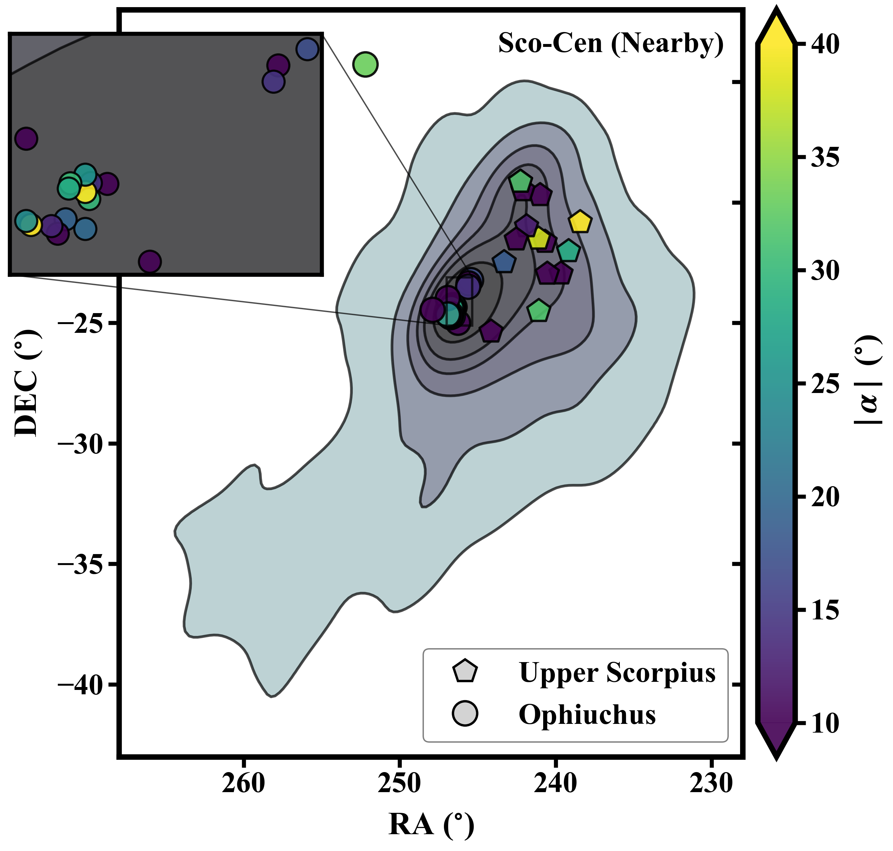

# Visualization Examples

This repository contains a number of figures I've created during the course of my graduate astrophysics career. 
Check out the Python scripts used to make each figure in the `examples/` folder.

## Structure

- `examples/` — Each subfolder contains code and output image for a single figure.
- `gallery/index.md` — A gallery overview showcasing all figures.

# Gallery Highlights

Several highlights. See the full [gallery](gallery/index.md) for a comprehensive list.

|  |  |
|:---:|:---:|
| **Sky Image with Overlay of Targets** [View code](examples/sky-image/sky_image.py) | **Sky Positions Relative to Sco-Cen** [View code](examples/sco-cen-contour/sco_cen_contour.py) |
