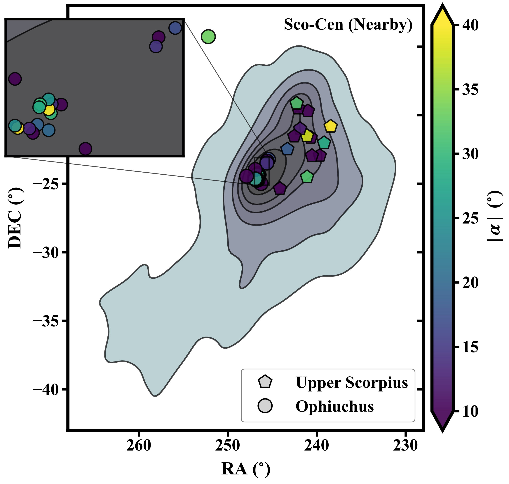

# Visualization Gallery

|  |  |
|:---:|:---:|
| **Sky Image with Overlay of Targets** [View code](../examples/sky-image/sky_image.py) | **Sky Positions Relative to Sco-Cen** [View code](../examples/sco-cen-contour/sco_cen_contour.py) |